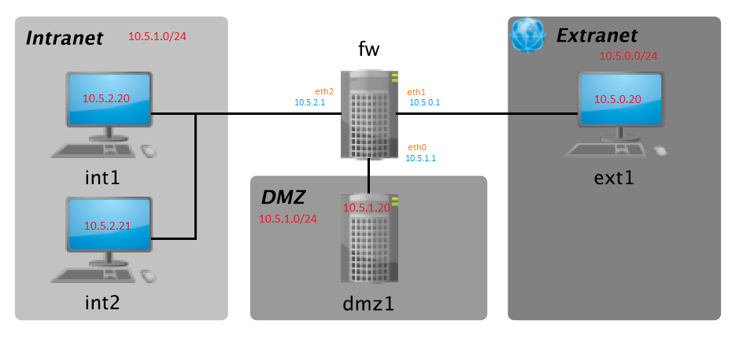

# Práctica DMZ - Sistemas Confiables

_Práctica 2 de la asignatura **Sistemas confiables** del máster universitario de investigación en Ciberseguridad de la Universidad de León_

## Dinámica de la práctica 🚀

Se pretende construir una DMZ para visualizar el comportamiento de **SNORT** y **Cowrie** (utilizando contenedores Docker para simular las máquinas) siguiendo la topología de red de la figura 1.


_Figura 2_

### Pre-requisitos 📋

_Que cosas necesitas para instalar el software_

```
Docker Docker version 20.10.21, build baeda1f
Docker Compose version v2.12.2
```

## Archivos 📦

```
.
├── 📂 dmz
│   ├── 📄 cowrie.cfg           # Archivo de configuración de Apache
│   ├── 📄 Dockerfile           # Dockerfile para construir la imagen de la DMZ
│   ├── 📄 userdb.txt           # Archivo de configuración de acceso al Honeypot SSH
│   └── 📄 start.sh             # Script para iniciar la DMZ    
├── 📄 ids.pdf                  # Documentación de la práctica
├── 📄 docker-compose.yml       # Archivo de configuración de Docker Compose
├── 📂 extranet
│   ├── 📄 Dockerfile           # Dockerfile para la imágen de la Extranet
│   └── 📄 start.sh             # Script para iniciar la Extranet
├── 📂 fw
│   ├── 📄 Dockerfile           # Dockerfile para la imágen del Firewall
|   ├── 📂 snort3-community-rules   # Targz con las reglas de SNORT
│   │   ├── 📄 AUTHORS
│   │   ├── 📄 LICENSE
│   │   ├── 📄 sid-msg.map
│   │   ├── 📄 snort3-community.rules   #Reglas de SNORT Community
│   │   └── 📄 VRT-License.txt
│   ├── 📄 snort.lua            # Archivo de configuración de SNORT
│   └── 📄 start.sh             # Script para iniciar el Firewall
├── 📂 img
│   └── 📸 dmz.png              # Imagen de la topología de red
├── 📂 intranet
│   ├── 📄 Dockerfile           # Dockerfile para la imágen de la Intranet
│   └── 📄 start.sh             # Script para iniciar la Intranet
├── README.md                   
└── 📂 scripts
    ├── 📄 dmz.sh               # Script para iniciar la consola DMZ    
    ├── 📄 external.sh          # Script para iniciar la consola Extranet
    ├── 📄 firewall.sh          # Script para iniciar la consola Firewall
    ├── 📄 internal.sh         # Script para iniciar la consola Intranet1
    └── 📄 run.sh               # Script para para los contenedores,reconstruir las imágenes 
                                y volver a iniciar los contenedores
```

## Vídeo demostrativo de funcionamiento 🎥

**Practica SNORT y Hopneypot COWRIE en DOCKER | Sistemas Confiables | Máster de Ciberseguridad | ULE** 

[](https://youtu.be/ikMiky9k3dU)

## Indicaciones para la ejecución de la práctica 📖

#### Inicio del servicio Cowrie 🚫
Cowrie no se puede iniciar con el usuario **root** desde el Dockerfile del container por lo que se debe crear un usuario con permisos de sudo para poder iniciar el servicio (_**Cowrie**_).
Se debe iniciar el servicio con dicho usuario, para ello se debe ejecutar el siguiente comando:

```
su cowrie
/home/cowrie/cowrie/bin/cowrie start
```

#### Inicio del servicio SNORT 📱

Para iniciar el servicio de **SNORT** se debe ejecutar el siguiente comando:

```
snort -c /usr/local/etc/snort/snort.lua -R /usr/local/etc/rules/snort3-community.rules -i eth1 -A full
```


## Construido con 🛠️

* [RPi 3 Model B+]() - Raspberry Pi 3 Model B+ 1GB RAM
* [Docker](https://docs.docker.com/engine/release-notes/) - Docker version 20.10.21
* [Ubuntu 22.04](https://releases.ubuntu.com/22.04/) - Ubuntu 22.04 LTS


## Autores ✒️


* **Pablo Javier Barrio Navarro** - *Realización de la Práctica SNORT* - [Pablo Javier Barrio Navarro](https://github.com/pbarrn00) 
* **Ángel Manuel Herrero Higueras** - *Propuesta de la Práctica SNORT* - [Ángel Manuel Herrero Higueras](https://www.researchgate.net/profile/Angel-Guerrero-Higueras)

## _My Social Media_ 🔗

* [Youtube](https://www.youtube.com/channel/UC5waeaJaVlue9qGkHp4557Q)  📢
* [Github](https://github.com/pbarrn00) 😺
* [LinkedIn](https://github.com/pbarrn00) ☑️
* [Twitter](https://twitter.com/pablosky157) 🐦
* [Onkisko Web](https://onkisko.es/) 📰


---
⌨️ con ❤️ por [NoobInTheNet](https://github.com/pbarrn00) 😊
